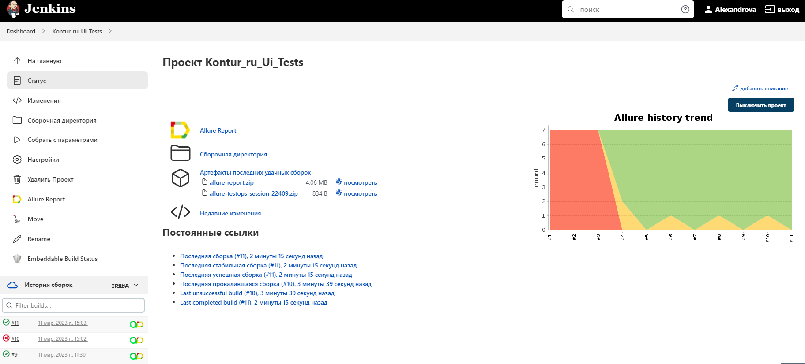
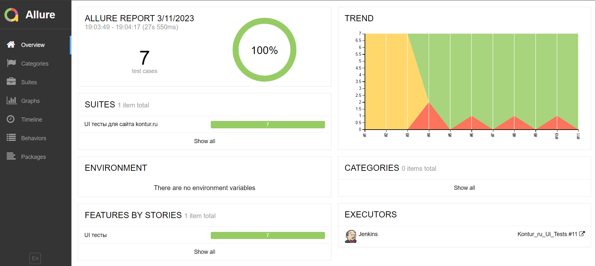
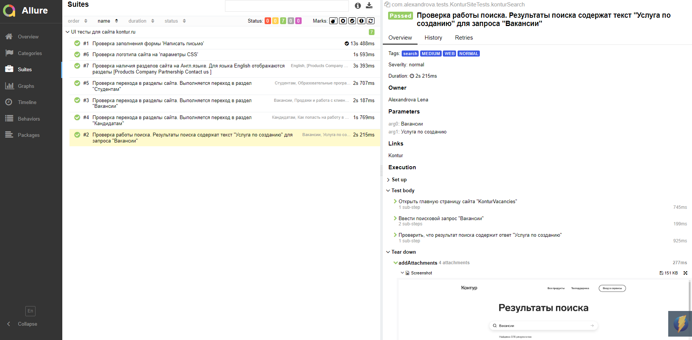
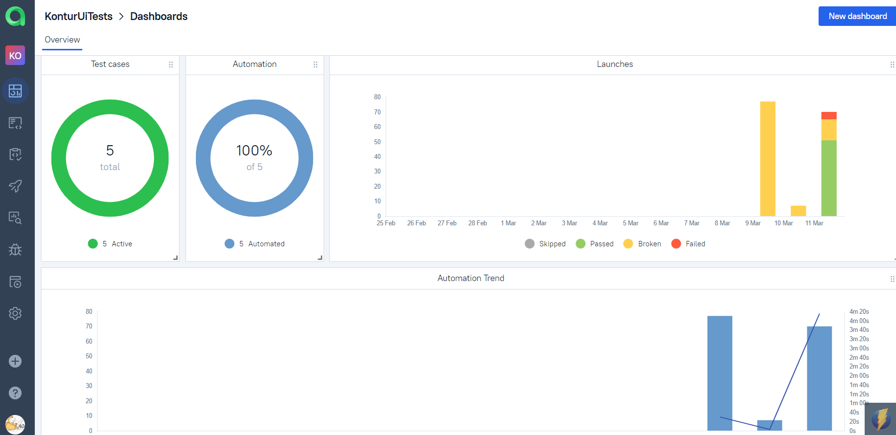
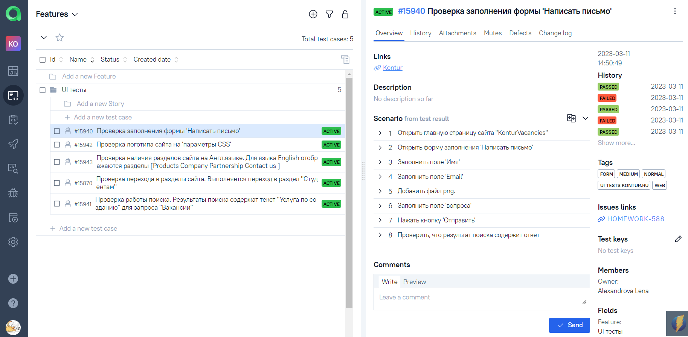
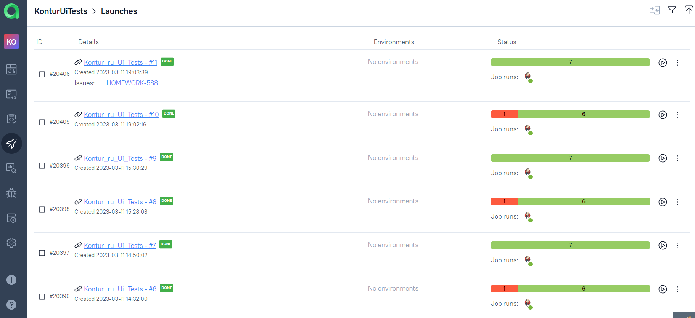
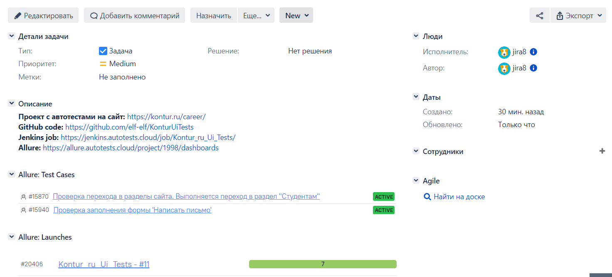
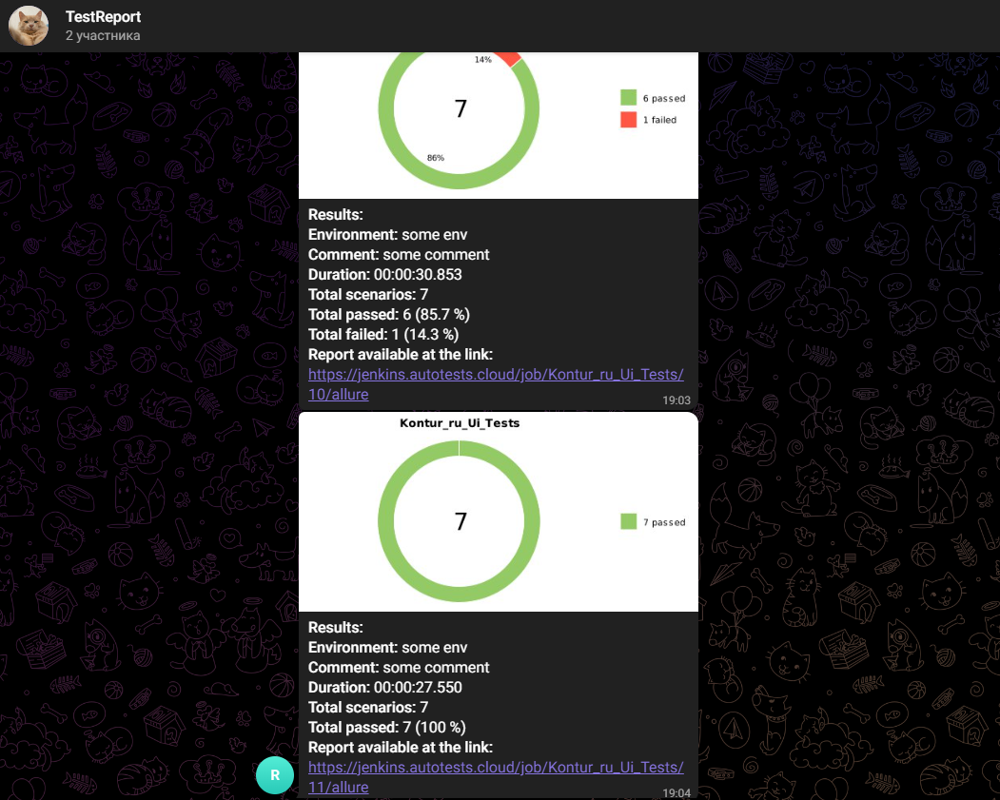
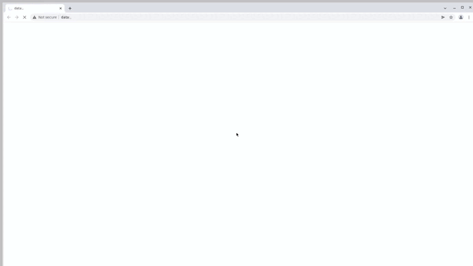

# Проект по автоматизации UI тестирования для сайта KonturUiTests

## 📘 Содержание:

- [Использованный стек технологий](#computer-использованный-стек-технологий)
- [Варианты запуска тестов](#running_woman-варианты-запуска-тестов)
- [Сборка в Jenkins](#-сборка-в-jenkins)
- [Allure-отчет](#-allure-отчет)
- [Интеграция с Allure TestOps](#-интеграция-с-allure-testops)
- [Интеграция с Jira](#-интеграция-с-Jira)
- [Уведомление в Telegram с использованием бота](#-уведомление-в-telegram-с-использованием-бота)
- [Видео запуска одного из тестов в Selenoid](#-видео-запуска-одного-из-тестов-в-selenoid)

## :computer: Использованный стек технологий

<p align="center">


</p>

Параметризованные автотесты написаны на <code>Java</code> с использованием <code>Gradle</code> и <code>JUnit 5</code>.
Для UI тестов используется фреймворк [Selenide](https://selenide.org/).
Тесты можно запускать локально или удаленно с помощью [Selenoid](https://aerokube.com/selenoid/).
Сборка в <code>Jenkins</code> реализована с формированием Allure-отчета и отправкой уведомления с результатами тестирования в <code>Telegram</code> после завершения прохождения тестов.

#### Allure-отчет включает в себя:
* названия тестов с шагами выполнения;
* скриншот страницы в браузере в момент завершения автотеста;
* Page Source;
* логи браузерной консоли;
* видео выполнения UI тестов.

## Варианты запуска тестов

### Локальный запуск тестов
С параметрами по умолчанию
```
gradle clean test -Denv=local
```

При необходимости можно изменить параметры запуска
```
gradle clean test
${TASK}
-Dbrowser=${BROWSER}
-Dversion=${VERSION}
-Dbrowsersize=${SIZE}
```

### Запуск тестов на удаленном браузере
```
gradle clean test -Denv=server
```
При необходимости можно изменить параметры запуска

```
gradle clean test -Denv=remote
-Dbrowser=${BROWSER}
-Dversion=${VERSION}
-Dbrowsersize=${SIZE}
```

### Параметры сборки

* <code>BROWSER</code> – браузер, в котором будут выполняться тесты. По-умолчанию - <code>chrome</code>.
* <code>VERSION</code> – версия браузера, в которой будут выполняться тесты. По-умолчанию - <code>109.0</code>.
* <code>SIZE</code> – размер окна браузера, в котором будут выполняться тесты. По-умолчанию - <code>1024x768</code>.

##  Сборка в Jenkins
### <a target="_blank" href="https://jenkins.autotests.cloud/job/Kontur_ru_Ui_Tests/">*Jenkins job*</a>

<p align="center">

</p>

##  Allure-отчет
### <a target="_blank" href="https://jenkins.autotests.cloud/job/Kontur_ru_Ui_Tests/11/allure/#">*Overview*</a>

<p align="center">

</p>

### *Результат прохождения параметризованных тестов с описанием  и шагами выполнения*

<p align="center">

</p>


##  Интеграция с Allure TestOps
### *Allure TestOps* <a target="_blank" href="https://allure.autotests.cloud/project/1998/dashboards">*Dashboard*</a>

<p align="center">  
  
</p>  

### *Тест кейсы*

<p align="center">  
  
</p>

### *Запуски*

<p align="center">  
  
</p>


##  Интеграция с <a target="_blank" href="https://jira.autotests.cloud/browse/HOMEWORK-588">**Jira**</a>


<p align="center">  
  
</p>  


##  Уведомление в Telegram с использованием бота

После завершения сборки специальный бот, созданный в <code>Telegram</code>, автоматически отправляет сообщение с отчетом прохождения тестов.

<p align="center">

</p>

##  Видео запуска одного из тестов в Selenoid

Для каждого теста выполняется запись видео. Ниже представлен пример видео прохождения теста.
<p align="center">
  
</p>
